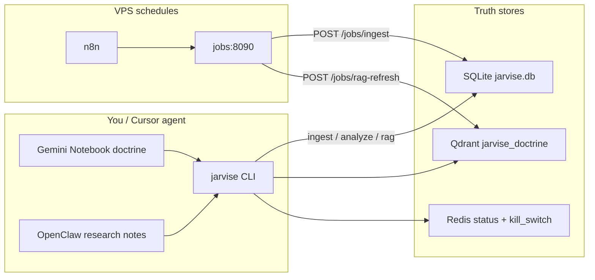

# Jarvise product usage (paper phase)

**Status:** There is no trading GUI and no live order placement. The shipped product is a **CLI + VPS background jobs + agent/MCP** surface for paper analytics only.



## 1. Primary invoke path — Python CLI

One-time install:

```powershell
python -m venv .venv
.venv\Scripts\pip install -e ".[dev]"
```

Entrypoint: `.venv\Scripts\jarvise` (see [`src/jarvise/cli.py`](../src/jarvise/cli.py)). On macOS/Linux use `.venv/bin/jarvise`.

| Command | Purpose |
|---------|---------|
| `jarvise status` / `init` / `config` | Local workspace |
| `jarvise ingest ...` | Fetch OHLCV (+ CoinGlass) → `data/analytics/jarvise.db` |
| `jarvise analyze ...` | Read DB → regime / confidence / size (paper) |
| `jarvise rag ...` | Sync doctrine → Qdrant |

Daily local examples:

```powershell
.venv\Scripts\jarvise ingest --symbol BTCUSDT --timeframe 1h --limit 200 --skip-derivatives --json
.venv\Scripts\jarvise analyze --symbol BTCUSDT --timeframe 4h --json
.venv\Scripts\jarvise analyze --universe paper_core --timeframe 4h --json
```

Compatibility aliases `jarvise-ingest` / `jarvise-analyze` still work; prefer `jarvise ...`.

## 2. VPS product (24/7) — scheduled, not click-driven

Deploy per [hostinger-vps.md](deploy/hostinger-vps.md): stack at `/opt/jarvise`, Tailscale only.

**Automatic** (n8n → jobs service in [`src/jarvise/jobs.py`](../src/jarvise/jobs.py)):

- Every ~15 minutes: `POST /jobs/ingest` → refresh market data
- Every ~6 hours: `POST /jobs/rag-refresh` → refresh doctrine RAG

**Manual on VPS when needed:**

```bash
docker compose -f docker-compose.yml -f docker-compose.prod.yml --profile tools run --rm worker \
  jarvise analyze --symbol BTCUSDT --timeframe 4h --json
```

UIs in this phase: n8n (`:5678`), control web health (`:8080`) — not a trading terminal.

## 3. Agent / Cursor path (chat, not app buttons)

- Cursor agent runs `.venv\Scripts\jarvise ...` per skill / README
- Doctrine: Gemini Notebook MCP + [`.cursor/skills/jarvise-notebook/SKILL.md`](../.cursor/skills/jarvise-notebook/SKILL.md) (`nlm` profile `chatoe`)
- Paper-only MCP example: [`mcp/jarvise-mcp.json.example`](../mcp/jarvise-mcp.json.example)
- OpenClaw writes notes → `jarvise rag sync-openclaw` → Qdrant (no orders)

## 4. Owner day workflow

1. **Market data fresh** — n8n ingest on VPS, or `jarvise ingest` by hand
2. **Paper signal** — `jarvise analyze --json` (or `--universe paper_core`)
3. **Paper fills (P2)** — `jarvise paper run --symbol BTCUSDT --timeframe 4h --json` (simulated ledger; no exchange orders)
4. **Check doctrine** — Notebook / RAG before any human decision
5. **Kill switch** — Redis `jarvise:kill_switch` per [ops.md](deploy/ops.md) to stop background work

**Not in this product yet:** live order entry, manual-approval gate (later deployment-ladder phases). Full path to auto-trade + analytics UI + exchange accounts: [product roadmap](superpowers/specs/2026-09-23-product-roadmap-design.md).

## Related

- [README quick start](../README.md)
- [Product roadmap (P0–P5)](superpowers/specs/2026-09-23-product-roadmap-design.md)
- [P1 Analytics UI plan](superpowers/plans/2026-09-23-p1-analytics-ui.md) — `/analytics` on VPS (`http://$TAILSCALE_IP:8080/analytics`)
- [P2 Paper auto-trade plan](superpowers/plans/2026-09-23-p2-paper-auto-trade.md) — `jarvise paper run|status`
- [Paper ingest design](superpowers/specs/2026-09-21-paper-ingest-design.md)
- [OpenClaw intelligence audit](superpowers/specs/2026-09-22-openclaw-intelligence-audit.md)
