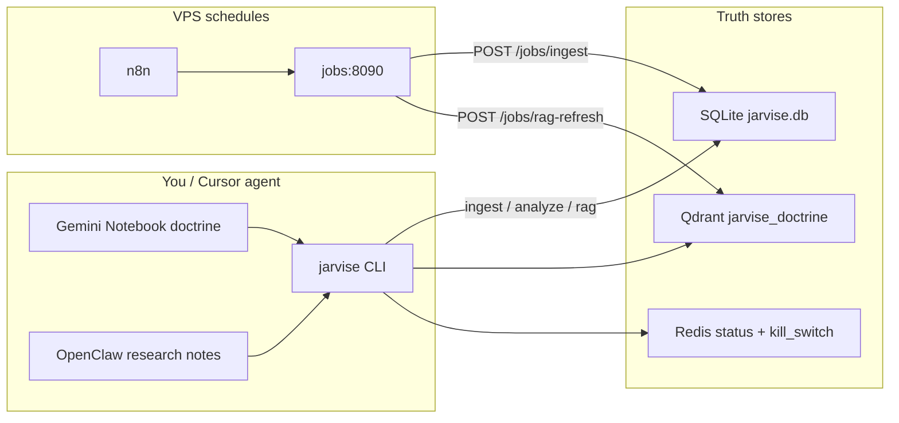

# Jarvise product usage (paper phase)

**Status:** No live order placement yet. Shipped through **§5.4 analyze replay**. Next: risk caps → P4-C review-only until gates.


```mermaid
flowchart LR
  subgraph human [You / Cursor agent]
    CLI["jarvise CLI"]
    Notebook["Gemini Notebook doctrine"]
    OpenClaw["OpenClaw research notes"]
  end
  subgraph auto [VPS schedules]
    n8n["n8n"]
    jobs["jobs:8090"]
  end
  subgraph data [Truth stores]
    SQLite["SQLite jarvise.db"]
    Qdrant["Qdrant jarvise_doctrine"]
    Redis["Redis status + kill_switch"]
  end
  CLI -->|"ingest / analyze / rag"| SQLite
  CLI --> Qdrant
  n8n --> jobs
  jobs -->|"POST /jobs/ingest"| SQLite
  jobs -->|"POST /jobs/rag-refresh"| Qdrant
  Notebook --> CLI
  OpenClaw --> CLI
  CLI --> Redis
```

## 1. Primary invoke path — Python CLI

One-time install:

```powershell
python -m venv .venv
.venv\Scripts\pip install -e ".[dev]"
```

Entrypoint: `.venv\Scripts\jarvise` (see [`src/jarvise/cli.py`](../src/jarvise/cli.py)). On macOS/Linux use `.venv/bin/jarvise`.

| Command | Purpose |
|---------|---------|
| `jarvise status` / `init` / `config` | Local workspace |
| `jarvise ingest ...` | Fetch OHLCV (+ CoinGlass) → `data/analytics/jarvise.db` (Binance klines = current default provider; venue-agnostic later) |
| `jarvise analyze ...` | Read DB → regime / confidence / size (paper) |
| `jarvise paper ...` | Enqueue / approve paper fills into local ledger (no exchange orders) |
| `jarvise exchange ...` | Read-only spot balance sync (Binance first; no order placement) |
| `jarvise rag ...` | Sync doctrine → Qdrant |

Daily local examples:

```powershell
.venv\Scripts\jarvise ingest --symbol BTCUSDT --timeframe 1h --limit 200 --skip-derivatives --json
.venv\Scripts\jarvise analyze --symbol BTCUSDT --timeframe 4h --json
.venv\Scripts\jarvise paper run --symbol BTCUSDT --timeframe 4h --json
.venv\Scripts\jarvise paper status --json
```

Compatibility aliases `jarvise-ingest` / `jarvise-analyze` still work; prefer `jarvise ...`.

### Paper + approval (P2/P4 paper slice)

`.venv/bin/jarvise paper run --symbol BTCUSDT --timeframe 4h --json`
→ enqueues `approval_queue` (default). Approve on `/analytics` or:

`.venv/bin/jarvise paper approve <id> --json`

Immediate fill escape hatch:

`.venv/bin/jarvise paper run --symbol BTCUSDT --timeframe 4h --auto-fill --json`

Expire timed-out pendings (no position change):

`.venv/bin/jarvise paper expire --json`

Expectancy (round-trips after fees):

`.venv/bin/jarvise paper metrics --json`  
`.venv/bin/jarvise paper metrics --persist --json`  # optional upsert into `performance_risk_metrics`

Also on `/analytics` → **Paper expectancy** card + `GET /api/paper/metrics`.

Historical replay (stored candles only):

```bash
# analysis-only (may use default DB)
.venv/bin/jarvise analyze --replay --since 2024-01-01 --universe paper_core --timeframe 4h --json

# paper fills require an isolated DB copy (refuses default live ledger)
cp data/analytics/jarvise.db /tmp/jarvise-bt.db
.venv/bin/jarvise analyze --replay --since 2024-01-01 --until 2024-06-01 \
  --universe paper_core --timeframe 4h --db /tmp/jarvise-bt.db --apply-paper --json
```

On Windows use `.venv\Scripts\jarvise` instead of `.venv/bin/jarvise`. Set `JARVISE_APPROVAL_TIMEOUT_MIN` in `.env` (see `.env.example`).

## 2. VPS product (24/7) — scheduled, not click-driven

Deploy per [hostinger-vps.md](deploy/hostinger-vps.md): stack at `/opt/jarvise`, Tailscale only.

**Automatic** (n8n → jobs service in [`src/jarvise/jobs.py`](../src/jarvise/jobs.py)):

- Every ~15 minutes: `POST /jobs/ingest` → refresh market data
- Every ~6 hours: `POST /jobs/rag-refresh` → refresh doctrine RAG
- Every ~4 hours: `POST /jobs/paper-run` → enqueue paper candidates (`paper_core` @ `4h` by default; **no** `--auto-fill`)
- Every ~1 hour: `POST /jobs/paper-expire` → mark timed-out approvals (no FLAT)

Approve/Reject still happens on `/analytics` (or `jarvise paper approve|reject`).

**Manual on VPS when needed:**

```bash
docker compose -f docker-compose.yml -f docker-compose.prod.yml --profile tools run --rm worker \
  jarvise analyze --symbol BTCUSDT --timeframe 4h --json
```

UIs in this phase: n8n (`:5678`), control web health (`:8080`) — not a trading terminal.

## 3. Agent / Cursor path (chat, not app buttons)

- Cursor agent runs `.venv\Scripts\jarvise ...` per skill / README
- Doctrine: Gemini Notebook MCP + [`.cursor/skills/jarvise-notebook/SKILL.md`](../.cursor/skills/jarvise-notebook/SKILL.md) (`nlm` profile `chatoe`)
- Paper-only MCP example: [`mcp/jarvise-mcp.json.example`](../mcp/jarvise-mcp.json.example) (includes optional TradingView research MCP)
- OpenClaw writes notes → `jarvise rag sync-openclaw` → Qdrant (no orders)

### Research overlay vs controlled truth

| Layer | Source | Role |
|-------|--------|------|
| Controlled numeric contract | `jarvise ingest` → SQLite (today: Binance public klines) | OHLCV + indicators that drive analyze/paper; **venue-agnostic** — any provider that is efficient, stable, and secure can be added later |
| Doctrine | NotebookLM → `jarvise rag sync-notebook` → Qdrant | Rules / risk; not a price feed |
| Research overlay | [tradingview-mcp](https://github.com/atilaahmettaner/tradingview-mcp) (Cursor MCP) | Screener / MTF / chat backtest — **do not** silent-merge into `market_technicals` or drive paper/live fills alone |

Trade **worldwide** (not Binance-only). New venues/accounts must plug into Jarvise with efficiency, stability, and security (no withdrawal keys; live stays ladder-gated).

Windows note for TradingView MCP: pin `uvx --python 3.13` (3.14 not supported yet). Optional official connector: `https://mcp.tradingview.com/mcp` if you have Essential+.

## 4. Owner day workflow

1. **Market data fresh** — n8n ingest on VPS, or `jarvise ingest` by hand
2. **Paper signal** — `jarvise analyze --json` (or `--universe paper_core`)
3. **Paper candidate (P2/P4)** — `jarvise paper run ...` enqueues approval by default; approve on `/analytics` or `jarvise paper approve <id>` (or `--auto-fill` for immediate simulated fill; no exchange orders)
4. **Check doctrine** — Notebook / RAG before any human decision
5. **Kill switch** — Redis `jarvise:kill_switch` per [ops.md](deploy/ops.md) to stop background work and block enqueue/approve

**Not in this product yet:** live order entry (P4-C+). Design draft: [P4-C live submit](superpowers/specs/2026-09-27-p4c-live-submit-design.md). Full path: [product roadmap](superpowers/specs/2026-09-23-product-roadmap-design.md).

## Related

- [README quick start](../README.md)
- [Product roadmap (P0–P5)](superpowers/specs/2026-09-23-product-roadmap-design.md)
- [P1 Analytics UI plan](superpowers/plans/2026-09-23-p1-analytics-ui.md) — `/analytics` on VPS (`http://$TAILSCALE_IP:8080/analytics`)
- [P2 Paper auto-trade plan](superpowers/plans/2026-09-23-p2-paper-auto-trade.md) — `jarvise paper run|status`
- [P3 Exchange read-only plan](superpowers/plans/2026-09-23-p3-exchange-readonly.md) — `jarvise exchange sync-balances`, `/analytics` spot panel
- [P4 Manual approval paper slice plan](superpowers/plans/2026-09-23-p4-manual-approval-paper-slice.md) — queue, CLI approve/reject/expire, `/analytics` card
- [P4-C live submit design (draft)](superpowers/specs/2026-09-27-p4c-live-submit-design.md) — size-capped live spot on Approve; review before plan/code
- [Paper ingest design](superpowers/specs/2026-09-21-paper-ingest-design.md)
- [OpenClaw intelligence audit](superpowers/specs/2026-09-22-openclaw-intelligence-audit.md)
