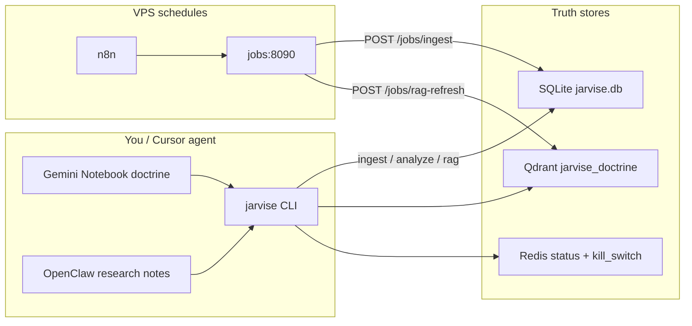

# Jarvise product usage (paper phase)

**Status:** P4-C live submit code shipped gated off (`JARVISE_LIVE_TRADING=false`). Approve stays paper-only until owner enables trade keys + flag on VPS.


```mermaid
flowchart LR
  subgraph human [You / Cursor agent]
    CLI["jarvise CLI"]
    Notebook["Gemini Notebook doctrine"]
    OpenClaw["OpenClaw research notes"]
  end
  subgraph auto [VPS schedules]
    n8n["n8n"]
    jobs["jobs:8090"]
  end
  subgraph data [Truth stores]
    SQLite["SQLite jarvise.db"]
    Qdrant["Qdrant jarvise_doctrine"]
    Redis["Redis status + kill_switch"]
  end
  CLI -->|"ingest / analyze / rag"| SQLite
  CLI --> Qdrant
  n8n --> jobs
  jobs -->|"POST /jobs/ingest"| SQLite
  jobs -->|"POST /jobs/rag-refresh"| Qdrant
  Notebook --> CLI
  OpenClaw --> CLI
  CLI --> Redis
```

## 1. Primary invoke path — Python CLI

One-time install:

```powershell
# Python 3.12 required (3.11+ ok; prefer 3.12)
py -3.12 -m venv .venv
.venv\Scripts\pip install -e ".[dev]"
```

On macOS/Linux: `python3.12 -m venv .venv`, then use `.venv/bin/…`.

Entrypoint: `.venv\Scripts\jarvise` (see [`src/jarvise/cli.py`](../src/jarvise/cli.py)). On macOS/Linux use `.venv/bin/jarvise`.

| Command | Purpose |
|---------|---------|
| `jarvise status` / `init` / `config` | Local workspace |
| `jarvise ingest ...` | Fetch OHLCV (+ derivatives + Binance book + CoinGecko macro) → `data/analytics/jarvise.db`. Derivatives default = Binance Futures public funding/OI (no key); CoinGlass when `COINGLASS_API_KEY` is set |
| `jarvise analyze ...` | Read DB → regime / confidence / size (paper) |
| `jarvise paper ...` | Enqueue / approve paper fills into local ledger (no exchange orders) |
| `jarvise exchange ...` | Read-only spot balance sync (Binance first; no order placement). `/analytics` shows ~USD via public USDT tickers. |
| `jarvise rag ...` | Sync doctrine → Qdrant |

Daily local examples (ingest and analyze must use the **same** timeframe):

```powershell
.venv\Scripts\jarvise ingest --symbol BTCUSDT --timeframe 4h --limit 200 --json
.venv\Scripts\jarvise analyze --symbol BTCUSDT --timeframe 4h --json
.venv\Scripts\jarvise paper run --symbol BTCUSDT --timeframe 4h --json
.venv\Scripts\jarvise paper status --json
```

Compatibility aliases `jarvise-ingest` / `jarvise-analyze` still work; prefer `jarvise ...`.

### Paper + approval (P2/P4 paper slice)

`.venv/bin/jarvise paper run --symbol BTCUSDT --timeframe 4h --json`
→ enqueues `approval_queue` (default). Approve on `/analytics` or:

`.venv/bin/jarvise paper approve <id> --json`

Immediate fill escape hatch:

`.venv/bin/jarvise paper run --symbol BTCUSDT --timeframe 4h --auto-fill --json`

Expire timed-out pendings (no position change):

`.venv/bin/jarvise paper expire --json`

Backfill stops on open paper positions (dry-run first):

`.venv/bin/jarvise paper backfill-stops --dry-run --json`
`.venv/bin/jarvise paper backfill-stops --apply --json`

Mark-to-market + stop exits + daily halt:

`.venv/bin/jarvise paper risk-monitor --json`

Expectancy (round-trips after fees):

`.venv/bin/jarvise paper metrics --json`  
`.venv/bin/jarvise paper metrics --persist --json`  # optional upsert into `performance_risk_metrics`

Also on `/analytics` → **Paper expectancy** card + `GET /api/paper/metrics`.

Historical replay (stored candles only):

```bash
# analysis-only (may use default DB)
.venv/bin/jarvise analyze --replay --since 2024-01-01 --universe paper_core --timeframe 4h --json

# paper fills require an isolated DB copy (refuses default live ledger)
cp data/analytics/jarvise.db /tmp/jarvise-bt.db
.venv/bin/jarvise analyze --replay --since 2024-01-01 --until 2024-06-01 \
  --universe paper_core --timeframe 4h --db /tmp/jarvise-bt.db --apply-paper --json

# closer to paper auto-decide code gates (same-side hold, opposite defer; no Claude)
.venv/bin/jarvise analyze --replay --since 2024-01-01 --universe paper_core --timeframe 4h \
  --db /tmp/jarvise-bt.db --apply-paper --paper-policy rules --json
```

On Windows use `.venv\Scripts\jarvise` instead of `.venv/bin/jarvise`. Set `JARVISE_APPROVAL_TIMEOUT_MIN` in `.env` (see `.env.example`).

## 2. VPS product (24/7) — scheduled, not click-driven

Deploy per [hostinger-vps.md](deploy/hostinger-vps.md): stack at `/opt/jarvise`, Tailscale only.

**Local vs VPS SQLite (not the same book):** `data/analytics/jarvise.db` is gitignored. A laptop Dashboard (`:8080` / Vite `:5173` / another local port) reads a local file that is often missing, so `ensure_paper_account` seeds **$10,000**. The 24/7 book is `/opt/jarvise/data/analytics/jarvise.db` on a compose bind-mount. Deploy updates code only (`git checkout -f`); it does **not** call `reset_paper_ledger` and does **not** `compose down -v`. Replay `--apply-paper` may wipe an **isolated copy** only. To inspect the same numbers locally, copy that VPS file read-only — do not expect `git pull` to reset or sync the ledger.

**Automatic** (n8n → jobs service in [`src/jarvise/jobs.py`](../src/jarvise/jobs.py)):

- Every ~15 minutes: `POST /jobs/ingest` → refresh market data (includes Alternative.me Fear & Greed as context)
- Every ~15 minutes: `POST /jobs/risk-monitor` → paper MTM + stop FLAT + daily halt (runs even if kill-switch is on; **no live orders**)
- Every ~6 hours: `POST /jobs/rag-refresh` → refresh doctrine RAG (indexes owner protocol extracts + OpenClaw only; generic Notebook scrapes stay on disk for NotebookLM but are not embedded)
- Every ~4 hours: `POST /jobs/paper-run` → enqueue paper candidates (`paper_core` @ `4h` by default; **no** `--auto-fill`), then `POST /jobs/paper-auto-decide` → no-op unless `JARVISE_PAPER_AUTO_DECIDE=true`
- Every ~1 hour: `POST /jobs/paper-expire` → mark timed-out approvals (timeout → **hold** if open paper position is already the same side; otherwise timeout → FLAT)
- Every ~1 hour: `POST /jobs/ingest-health` → Telegram alert when `ema_200` warm-up is missing, candles are stale, or the series has gaps (alert only; fix with the one-shot backfill shown in the message)
- Every ~1 hour (only after live is enabled): `POST /jobs/live-reconcile` → read-only `GET /api/v3/order` by `jrv-<approval id>` for open `live_orders`; persists fill state; places nothing. Also `jarvise trade reconcile --json`.

Approve/Reject on the Command Dashboard Home (`http://$TAILSCALE_IP:8080/`) or `jarvise paper approve|reject`. Legacy `/analytics` serves the same SPA.
Optional Telegram alerts when `TELEGRAM_BOT_TOKEN` + `TELEGRAM_CHAT_ID` are set (enqueue + hourly pending digest via n8n `Jarvise paper pending digest`). Soft-fail if unset.

**Recommendation card (Thai):** every pending row on Home has "ดูคำแนะนำ" — what happened, dollar risk, doctrine, and a checklist, so you can Approve/Reject without reading charts. The Approve button is labelled "(แนะนำ)" or "(ระวัง)" from the template rule (`conf ≥ 0.70` approve, `0.55–0.69` caution, otherwise reject). Buttons are never disabled by the card.

**Paper auto-decide (optional, default off):** set `JARVISE_PAPER_AUTO_DECIDE=true` + `OPENROUTER_API_KEY` on the `jobs` service. After each paper-run, Claude reviews candidates that passed Jarvise's filters and approves (simulated fill, reason `auto:claude:approve`), rejects (`auto:claude:reject:<reason>`), or defers. Same-symbol **same-side** open is auto-held in code without Claude (`auto:rule:same_side_hold` → approve no-op); **opposite-side** open is forced defer (`auto:rule:opposite_side_open`). Deferred rows stay pending and you get one Telegram summary per run. Spec: [paper auto-decide](superpowers/specs/2026-10-02-paper-auto-decide-design.md). Live stays off; the job refuses when `JARVISE_LIVE_TRADING=true`.

**Auto-decide feedback (T2.1):** paper fills stamp `approval_id` + `decision_source` (`manual` / `auto_claude` / `auto_rule`). Closed round-trips sync into `paper_decision_outcomes`; `GET /api/paper/metrics` exposes `by_decision_source` and `by_decision_source_30d`. Auto-run summaries persist in `paper_auto_runs`. Optional soft gate: set `JARVISE_AUTO_DECIDE_MIN_EV` (e.g. `0`) and `JARVISE_AUTO_DECIDE_MIN_EV_N` (default 10) — when 30d auto EV is below the floor with enough trades, auto-decide skips (`reason: auto_ev_gate`) and leaves candidates for manual Approve. Never auto-raises size or lowers min_conf. **Owner step (not automatic):** enable the gate and restore `JARVISE_ANALYZE_MTF=true` only after ~10+ closed `auto_*` trades in `by_decision_source_30d` — see `PROJECT_CONTEXT.md` §5 Owner / ops next.

**Portfolio risk (T2.2):** besides per-order notional / **UTC-day** realized loss / drawdown lock, enqueue + approve enforce `JARVISE_MAX_OPEN_POSITIONS` (default 2), `JARVISE_MAX_GROSS_NOTIONAL_PCT` (10), `JARVISE_MAX_SYMBOL_NOTIONAL_PCT` (6), and `JARVISE_MAX_CORRELATED_BUCKET_PCT` (10) for bucket `crypto_majors` (BTC+ETH). Soft portfolio breach blocks without engaging the kill-switch; account-level breaches still engage it. Caps appear on Ops → risk_caps. `JARVISE_MAX_DAILY_LOSS_USD` on paper matches live: closed round-trip PnL in the current UTC calendar day, not lifetime vs starting equity.

**Analyzer MTF (T2.3):** paper/analyze use LTF = `JARVISE_PAPER_TIMEFRAME` with HTF confirm from `JARVISE_ANALYZE_HTF` (default `1d`). Directional LTF is forced flat on HTF range/chaotic/conflict or missing HTF candle (`mtf_reason`). Ingest job refreshes `1h` + paper TF + HTF. Disable with `JARVISE_ANALYZE_MTF=false` (must be in compose env for `jobs`/`web` — see `docker-compose.yml`). For temporary paper-EV sampling set `JARVISE_ANALYZE_MTF=false` on VPS `.env`, recreate jobs/web, then restore `true` after enough `auto_*` closed trades. TradingView stays research overlay only.

**Observability (T2.4):** `GET /metrics` on web (`:8080`) and jobs (`:8090`) expose Prometheus text (kill-switch, queue depth, job runs/duration). Optional compose profile `obs` runs Prometheus + Grafana (256m limits) — `docker compose -f docker-compose.yml -f docker-compose.prod.yml --profile obs up -d`. Local bind `127.0.0.1:9090` / `:3000`; on VPS, Tailscale `:9090` / `:3000`. Ops page links to Grafana.

**Wait-time research overlays (A):** Cursor skills `jarvise-notebook` + `jarvise-binance-intel` (already in `.cursor/skills/`). Optional MCP: TradingView + CoinGecko (free) + CoinGecko Docs + n8n — copy from [`mcp/jarvise-mcp.json.example`](../mcp/jarvise-mcp.json.example). **Never** enable Eterna MCP, Binance execution MCP, or CoinGecko Agent SKILL. Overlays are chat context only; paper fills stay SQLite ingest.

**Wait-time ops (C):** n8n `Jarvise ingest health` (hourly) + pending digest + Telegram (`TELEGRAM_*`) keep candles/EMA200 visible. VPS compose `--profile obs` is up (Grafana/Prometheus Tailscale `:3000`/`:9090`). Do **not** flip `JARVISE_LIVE_TRADING`, `JARVISE_AUTO_DECIDE_MIN_EV`, or restore `JARVISE_ANALYZE_MTF=true` until ~10 closed `auto_*` trades.

**Stocks / ETF paper (T2.6):** universe `paper_equity` (SPY, QQQ) ingests via Stooq CSV (`jarvise ingest --universe paper_equity --timeframe 1d --skip-book --skip-derivatives`). Skips Binance book/deriv; market-safety auto-skips those streams for equity symbols. Paper fee `JARVISE_PAPER_EQUITY_FEE_BPS` (default 2). Weekend holes on 1d are not reported as gaps. No broker live.

**Paper fees:** simulated fills use **10 bps** by default (Binance spot taker, no BNB discount) plus slip `max(5 bps, half bid-ask spread)` when book data exists. Override fee with `JARVISE_PAPER_FEE_BPS`. Each fill stores `fee_bps` on `paper_orders`.

**n8n after deploy:** workflows are files, not auto-imported — in n8n re-import `infra/n8n/workflows/jarvise-paper-run.json` (adds the auto-decide node) and import + activate `jarvise-ingest-health.json`.

**Manual on VPS when needed:**

```bash
docker compose -f docker-compose.yml -f docker-compose.prod.yml --profile tools run --rm worker \
  jarvise analyze --symbol BTCUSDT --timeframe 4h --json
```

UIs in this phase: n8n (`:5678`), Command Dashboard (`:8080` — Home / Paper / Decisions / Exchange / Ops) — not a public trading terminal.

## 3. Agent / Cursor path (chat, not app buttons)

- Cursor agent runs `.venv\Scripts\jarvise ...` per skill / README
- Doctrine: Gemini Notebook MCP + [`.cursor/skills/jarvise-notebook/SKILL.md`](../.cursor/skills/jarvise-notebook/SKILL.md) (`nlm` profile `chatoe`)
- Paper-only MCP example: [`mcp/jarvise-mcp.json.example`](../mcp/jarvise-mcp.json.example) (includes optional TradingView research MCP)
- OpenClaw writes notes → `jarvise rag sync-openclaw` → Qdrant (no orders)

### Research overlay vs controlled truth

| Layer | Source | Role |
|-------|--------|------|
| Controlled numeric contract | `jarvise ingest` → SQLite (today: Binance public klines) | OHLCV + indicators that drive analyze/paper; **venue-agnostic** — any provider that is efficient, stable, and secure can be added later |
| Doctrine | NotebookLM → `jarvise rag sync-notebook` → Qdrant | Rules / risk; not a price feed |
| Research overlay | [tradingview-mcp](https://github.com/atilaahmettaner/tradingview-mcp) (Cursor MCP) | Screener / MTF / chat backtest — **do not** silent-merge into `market_technicals` or drive paper/live fills alone |
| Research overlay / venue candidate | [Eterna MCP](https://github.com/EternaHybridExchange/eterna-mcp) (`mcp.eterna.exchange`, **not wired**) | Agent read-only research and future venue evaluation only — **never** paper fills or live orders via MCP; trading and funding SDK methods denied until the live checklist. Map: [eterna-for-jarvise.md](exchange/eterna-for-jarvise.md) |

Trade **worldwide** (not Binance-only). New venues/accounts must plug into Jarvise with efficiency, stability, and security (no withdrawal keys; live stays ladder-gated).

Windows note for TradingView MCP: pin `uvx --python 3.13` (3.14 not supported yet). Optional official connector: `https://mcp.tradingview.com/mcp` if you have Essential+.

## 4. Owner day workflow

1. **Market data fresh** — n8n ingest on VPS, or `jarvise ingest` by hand
2. **Paper signal** — `jarvise analyze --json` (or `--universe paper_core`)
3. **Paper candidate (P2/P4)** — `jarvise paper run ...` enqueues approval by default; approve on Command Dashboard Home (`:8080/`) or `jarvise paper approve <id>` (or `--auto-fill` for immediate simulated fill; no exchange orders)
4. **Check doctrine** — Notebook / RAG before any human decision
5. **Kill switch** — Redis `jarvise:kill_switch` per [ops.md](deploy/ops.md) to stop background work and block enqueue/approve

**Not in this product yet (default):** live orders stay off until `JARVISE_LIVE_TRADING=true` + `BINANCE_TRADE_*` keys (spot trade only, no withdraw). Spec: [P4-C live submit](superpowers/specs/2026-09-27-p4c-live-submit-design.md). Full path: [product roadmap](superpowers/specs/2026-09-23-product-roadmap-design.md).

## Related

- [README quick start](../README.md)
- [Product roadmap (P0–P5)](superpowers/specs/2026-09-23-product-roadmap-design.md)
- [P1 Analytics UI plan](superpowers/plans/2026-09-23-p1-analytics-ui.md) — `/analytics` on VPS (`http://$TAILSCALE_IP:8080/analytics`)
- [shadcn/ui for Jarvise](ux-ui/shadcn-for-jarvise.md) — shadcn knowledge for the shipped Command Dashboard SPA (`web/`)
- [P2 Paper auto-trade plan](superpowers/plans/2026-09-23-p2-paper-auto-trade.md) — `jarvise paper run|status`
- [P3 Exchange read-only plan](superpowers/plans/2026-09-23-p3-exchange-readonly.md) — `jarvise exchange sync-balances`, `/analytics` spot panel
- [P4 Manual approval paper slice plan](superpowers/plans/2026-09-23-p4-manual-approval-paper-slice.md) — queue, CLI approve/reject/expire, `/analytics` card
- [P4-C live submit](superpowers/specs/2026-09-27-p4c-live-submit-design.md) — size-capped live spot on Approve; flag default off
- [Paper ingest design](superpowers/specs/2026-09-21-paper-ingest-design.md)
- [OpenClaw intelligence audit](superpowers/specs/2026-09-22-openclaw-intelligence-audit.md)
