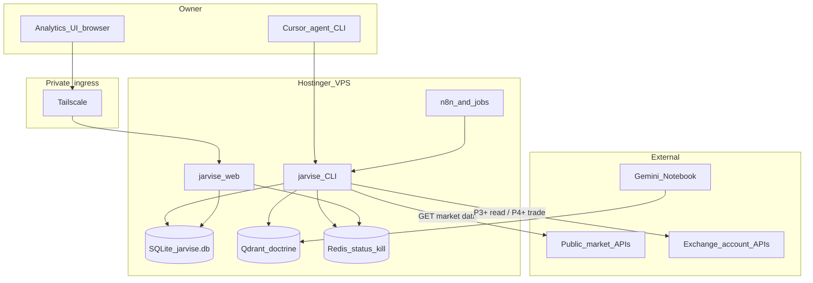
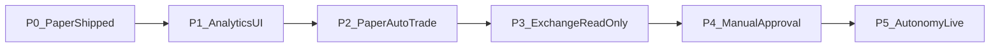

# Jarvise product roadmap — design

**Date:** 2026-09-23  
**Status:** Roadmap approved for sequencing; no phase implementation until a separate “implement Pn” request  
**Usage today:** [docs/product-usage.md](../../product-usage.md)  
**Notebook / doctrine:** [Jarvise : Crypto Trader](https://notebooklm.google.com/notebook/14e11c63-e2ee-4b49-898f-b0cc4c61cb4e)

## 1. Goal / non-goals

### Goal

Climb from the shipped paper-analytics surface to an owner-protective product that includes:

1. **Analytics UI** — signals, portfolio, risk at a glance  
2. **Exchange accounts** — e.g. Binance balances/positions, then gated orders  
3. **Auto-trade** — only after manual-approval is proven, with kill-switch and hard caps  

Deployment ladder (non-negotiable): **paper → manual approval → autonomy**. Live trading stays **off by default**.

### Non-goals (this document)

- Implementing any phase’s code  
- Public marketing site or multi-tenant SaaS  
- Jumping straight to live auto-trade without P1–P4 exit criteria  
- Using Obsidian / markdown vaults as OHLCV or numeric truth  
- Treating Gemini Notebook as a live price or order-book feed  

## 2. Infra roles

| Piece | Role |
|-------|------|
| **Hostinger VPS** (`/opt/jarvise`) | 24/7 runtime: Docker (Redis, Qdrant, n8n, OpenClaw, jobs, web), schedules, SQLite bind mount |
| **Tailscale** | Private ingress only — reach control plane / analytics UI without publishing those ports on the public IPv4 |
| **Laptop** | Local `jarvise` CLI, Cursor agents, one-off ingest/analyze; does not replace VPS for always-on work |
| **Binance (global)** | Market data today (public klines); later read-only account, then gated trading APIs — not locked to Binance TH |

Tailscale is **not** the product. Analytics and trading logic run on the VPS (and/or CLI); Tailscale is how the owner opens private UIs safely.

## 3. Architecture (target)

**Numeric truth:** SQLite / Parquet under `data/analytics/` (`jarvise.db`, `jarvise_ingest`). Indicators recomputed from the full stored series.

**Doctrine:** NotebookLM sync + allowlisted fetch/Firecrawl → Qdrant `jarvise_doctrine`. Combine with notebook rules before any trade call (human or autonomous).

## 4. Phases

| Phase | Name | Outcome | Exit criteria |
|-------|------|---------|---------------|
| **P0** | Paper baseline (shipped) | CLI ingest/analyze/rag; VPS schedules; control kill-switch | Documented in [product-usage.md](../../product-usage.md); **no order placement** |
| **P1** | Analytics UI | Owner sees latest `analysis_output` + ingest/RAG health on VPS web | Filter by symbol/timeframe; PAPER ONLY banner; no trade buttons |
| **P2** | Paper auto-trade | Simulated fills from analyze + closed candles into a local ledger | `jarvise paper run\|status`; fees/slippage approx; metrics written; kill-switch stops paper schedules; **no exchange trade API** |
| **P3** | Exchange read-only | Binance (global) balances/positions shown beside paper ledger | Read-only API keys in VPS `.env` only; UI never echoes secrets; **no submit-order code path** |
| **P4** | Manual approval | Queue of signals → Approve once → size-capped live order | Reject/timeout → FLAT; max notional + max daily loss + kill-switch enforced |
| **P5** | Autonomy | Auto live orders when confidence/doctrine/risk pass | Explicit flag default **off**; requires stable P4; drawdown lock + kill-switch; full order audit in DB |

### P0 — Baseline (shipped)

- Entrypoint: `jarvise` (`ingest`, `analyze`, `rag`, workspace commands)  
- Background: n8n → `jobs:8090` ingest (~15m) and rag-refresh (~6h)  
- Control web: kill-switch / Redis / Qdrant health (`src/jarvise_web`)  
- Guardrail: GET-only market HTTP; OpenClaw research-only  

### P1 — Analytics UI

Extend [`src/jarvise_web/app.py`](../../../src/jarvise_web/app.py) (Tailscale-bound):

- Table of latest rows from `analysis_output` (regime, confidence, invalidation, size)  
- Ingest / RAG last-status from Redis  
- Filters: symbol, timeframe  
- Still **PAPER ONLY** — no order or approve controls  

**Implementation plan:** [2026-09-23-p1-analytics-ui.md](../plans/2026-09-23-p1-analytics-ui.md). Owner URL: `http://$TAILSCALE_IP:8080/analytics`.

### P2 — Paper auto-trade

- SQLite ledger filled from `analyze` signals + closed candle prices  
- CLI: `jarvise paper run`, `jarvise paper status` (names may refine in implementation plan)  
- Surface positions/PnL on Analytics UI  
- Rough fees/slippage; upsert into reserved `performance_risk_metrics`  
- Kill-switch halts paper run schedules the same way it halts rag/ingest helpers that check it  
- **No** Binance (or other) signed trade endpoints  

**Implementation plan:** [2026-09-23-p2-paper-auto-trade.md](../plans/2026-09-23-p2-paper-auto-trade.md).

### P3 — Exchange account (read-only)

- Binance global account endpoints with **read-only** key permissions  
- Persist snapshots (e.g. `exchange_balances`) and show next to paper ledger  
- Secrets only in VPS environment; never commit; never render in HTML  
- Code review gate: no order-placement functions in this phase’s package surface  

### P4 — Manual approval

Paper slice (queue + `/analytics` approve, no live submit): [P4 paper slice design](2026-09-23-p4-manual-approval-paper-slice-design.md) and [implementation plan](../plans/2026-09-23-p4-manual-approval-paper-slice.md).

- Eligible signals enter `approval_queue`  
- UI: Approve / Reject; timeout → FLAT  
- On Approve: place size-capped live order; record in `live_orders`  
- Hard caps: max notional per order, max daily loss, kill-switch must be clear  
- Autonomy flag remains off  

### P5 — Autonomy (live auto-trade)

- Scheduler may place orders without per-trade click **only if** autonomy flag is on (default off)  
- Same risk caps + drawdown lock + kill-switch as P4  
- Every attempt logged for audit  
- Do not enable until P4 has run stably in production (owner judgment; not automatic)  

## 5. Data model deltas

Existing (P0): `market_technicals`, `derivatives_analytics`, reserved microstructure/onchain/performance tables, `analysis_output`, `universe_membership`.

| Table (approx.) | Phase | Purpose |
|-----------------|-------|---------|
| `paper_orders` | P2 | Simulated order intents and fills |
| `paper_positions` | P2 | Open/closed paper positions and PnL |
| `exchange_balances` | P3 | Read-only venue balance/position snapshots |
| `approval_queue` | P4 | Pending human approve/reject/timeout |
| `live_orders` | P4+ | Real venue orders and audit trail |

Exact columns land in each phase’s implementation plan; names above are the roadmap contract.

## 6. Guardrails checklist

- [ ] Ladder never skipped (no P5 without P4 exit)  
- [ ] Live / autonomy flags default **off**  
- [ ] Kill-switch respected by schedules and order paths  
- [ ] Capital caps before any live submit  
- [ ] Exchange secrets only in env; not in git or UI  
- [ ] Ingest remains GET-only market data until an explicit trade module owns signed POSTs  
- [ ] Doctrine (notebook + RAG) consulted before trade calls; notebook is not a price feed  
- [ ] Crypto path first; stocks/ETFs after crypto ladder is proven  
- [ ] Trade worldwide orientation (not Binance-TH-only)  

## 7. Out of scope / later

- Stocks/ETFs data and execution providers  
- Full order-book and on-chain writers (schema already reserved)  
- Public HTTPS analytics (optional alternative to Tailscale-only UI)  
- Multi-exchange routers beyond the first Binance global account path  
- Mobile apps  

## Related

- [Product usage (paper)](../../product-usage.md)  
- [P1 Analytics UI plan](../plans/2026-09-23-p1-analytics-ui.md)  
- [P2 Paper auto-trade plan](../plans/2026-09-23-p2-paper-auto-trade.md)  
- [Paper ingest design](2026-09-21-paper-ingest-design.md)  
- [OpenClaw intelligence audit](2026-09-22-openclaw-intelligence-audit.md)  
- [Hostinger VPS deploy](../../deploy/hostinger-vps.md)  
- [VPS ops](../../deploy/ops.md)  
