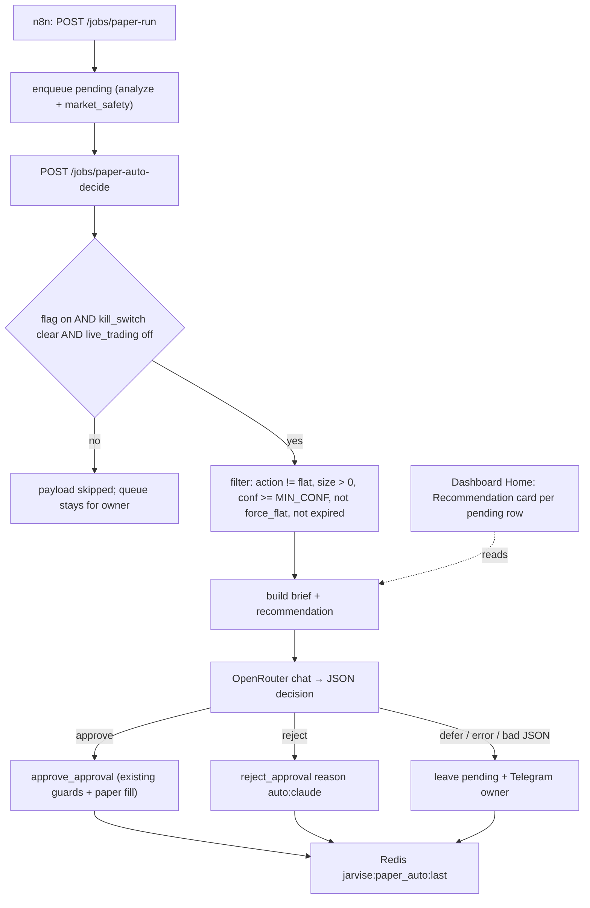

# Paper auto-decide + recommendation card — design

**Date:** 2026-10-02  
**Status:** Approved for implementation  
**Ladder position:** P4 paper approval → **paper auto-decide** (still paper; live stays off)  
**Paper-only:** auto path never submits exchange orders

## 1. Intent

The owner wants Jarvise to stop requiring click-by-click operation while remaining the single controller of policy and the kill-switch. In this phase:

1. Every pending paper candidate gets a plain-language **Recommendation card** (Thai) so the owner can decide without reading charts.
2. A new job lets **Claude via OpenRouter** confirm, reject, or defer each candidate automatically right after `paper-run`, behind a flag that is **off by default**.
3. A thin **ingest-health** check alerts when indicator warm-up is incomplete (the cause of the all-`flat` queue on 2026-10-02) — alert only, no automatic ingest.

End-state goal remains P5 live autonomy under owner policy. That is a later spec; nothing here enables live orders.

## 2. Roles

| Actor | Responsibility | Not responsible for |
|-------|----------------|---------------------|
| **Owner** | Flags, `JARVISE_PAPER_AUTO_DECIDE`, kill-switch, final call on `defer` | Reading indicators |
| **Jarvise** (analyze, risk, ledger, jobs, web) | Deterministic signal, hard filters, approve/reject execution, audit, recommendation text | Inventing trade direction |
| **Claude via OpenRouter** (inside `jobs`) | Second-layer confirm / reject / defer with a reason, bounded brief only | Bypassing filters, sizing, live orders |
| **OpenClaw gateway** | Control room: owner chat, research notes; no new skill in this phase | The approve path |

Approach chosen: the decision brain runs in Jarvise `jobs` and calls OpenRouter directly. OpenClaw is not in the approve loop (reproducible, testable, kill-switch first). Model routing stays on OpenRouter; switching to the Anthropic API later is a client-config change only.

## 3. Architecture



Two-layer rule: Jarvise filters first, Claude only sees candidates that already passed. `approve_approval` re-checks kill-switch, market safety, expiry, and risk caps internally, so the auto path inherits every existing guard without new fill code.

## 4. Components

| Path | Role |
|------|------|
| `src/jarvise_paper/recommendation.py` | Build recommendation JSON from approval row + latest candle indicators + ledger + doctrine snippets. Deterministic Thai templates; no LLM required. |
| `src/jarvise_paper/llm_openrouter.py` | Minimal `httpx` client: `chat_json(messages, model, timeout) -> dict`. Raises on non-2xx / timeout / non-JSON. No retries beyond one. |
| `src/jarvise_paper/auto_decide.py` | `run_auto_decide(conn, *, now_ms) -> dict`: gate → filter → brief → Claude → apply via `approve_approval` / `reject_approval` → payload. |
| `src/jarvise_ingest/health.py` | `ingest_health(conn, symbols, timeframe) -> dict`: `ema200_ready` count per symbol, latest candle age (min), gaps from stored series. |
| `src/jarvise/jobs.py` | Add routes `POST /jobs/paper-auto-decide` and `POST /jobs/ingest-health` following the existing `run_*` + `publish_redis_status` pattern, plus GET-only `GET /doctrine?q=&limit=` (jobs owns the embedding model; web has no `sentence-transformers`). |
| `src/jarvise_web/app.py` | `GET /api/approvals/{id}/recommendation` (doctrine fetched from `JARVISE_JOBS_URL/doctrine`, 5 s timeout, `[]` on error); `/api/status` adds `paper_auto` and `ingest_health` from Redis. |
| `web/src/lib/api.ts`, `web/src/components/ApprovalQueue.tsx` | Expandable row that lazily fetches the recommendation and renders the card. |
| `web/src/pages/OpsPage.tsx` | Show `paper_auto` last run and `ingest_health` summary. |
| `infra/n8n/workflows/jarvise-paper-run.json` | Append HTTP node: after `POST paper run` → `POST /jobs/paper-auto-decide` (timeout 180 s). |
| `infra/n8n/workflows/jarvise-ingest-health.json` | New hourly cron → `POST /jobs/ingest-health`. |
| `.env.example`, `docker-compose.yml` (jobs env) | New variables below. |
| `docs/product-usage.md` | Owner flow: card first, auto flag second, defer handling. |

Existing code reused unchanged: `approve_approval`, `reject_approval`, `list_approvals`, `get_approval` ([`src/jarvise_paper/approval.py`](../../../src/jarvise_paper/approval.py)); `kill_switch_engaged`, `publish_redis_status` ([`src/jarvise/jobs.py`](../../../src/jarvise/jobs.py)); `send_telegram_message` ([`src/jarvise_notify/telegram.py`](../../../src/jarvise_notify/telegram.py)); `evaluate_from_db` ([`src/jarvise_risk/market_safety.py`](../../../src/jarvise_risk/market_safety.py)); `thesis` / `invalidation_price` from [`src/jarvise_analyze/engine.py`](../../../src/jarvise_analyze/engine.py).

## 5. Environment

| Variable | Default | Meaning |
|----------|---------|---------|
| `JARVISE_PAPER_AUTO_DECIDE` | `false` | Master switch for the auto job. Off → job returns `skipped`. |
| `JARVISE_AUTO_DECIDE_MODEL` | `anthropic/claude-sonnet-4.5` | OpenRouter model id. |
| `JARVISE_AUTO_DECIDE_MIN_CONF` | `0.55` | Candidates below this never reach Claude (left pending). |
| `JARVISE_AUTO_DECIDE_MAX_PER_RUN` | `4` | Max Claude calls per job run; remainder deferred. |
| `JARVISE_AUTO_DECIDE_TIMEOUT_S` | `30` | Per-call HTTP timeout. |
| `OPENROUTER_API_KEY` | (existing) | Reused from the OpenClaw setup; missing key → every candidate deferred. |
| `JARVISE_INGEST_HEALTH_MAX_AGE_MIN` | `60` | Alert when the newest paper-timeframe candle **closed** more than this many minutes ago (`timestamp + interval`), so a 4h series with 15-minute ingest does not false-alarm. |
| `JARVISE_JOBS_URL` | `http://jobs:8090` | Web → jobs for doctrine snippets on the card (docker network only; reuses `JARVISE_JOBS_TOKEN` when set). |

All live in `.env.example` with comments. The `jobs` service gets the auto-decide and health variables; the web service only needs `JARVISE_JOBS_URL` (everything else it reads from Redis/SQLite).

## 6. Recommendation card contract

`GET /api/approvals/{id}/recommendation` → `200`:

```json
{
  "ok": true,
  "approval_id": "261b5544d1bfe916",
  "symbol": "BTCUSDT",
  "timeframe": "4h",
  "action": "long",
  "recommendation": "approve",
  "recommendation_source": "template",
  "confidence_label": "ปานกลาง-สูง",
  "headline": "แนะนำ: APPROVE (ความมั่นใจ 0.75)",
  "what_happened": [
    "ราคาอยู่เหนือเส้นค่าเฉลี่ยทั้งระยะสั้นและระยะยาว = แนวโน้มขาขึ้น",
    "โมเมนตัม RSI 65 ยังไม่ร้อนเกินไป",
    "ความผันผวนปกติ และ market safety ไม่พบสัญญาณอันตราย"
  ],
  "risk": {
    "size_pct_equity": 1.125,
    "notional_usd": 112.5,
    "equity_usd": 10000.0,
    "invalidation_price": 84159.85,
    "est_loss_usd": 1.78,
    "stop_atr_multiple": 1.5
  },
  "doctrine": [
    "structure first, oscillators as context",
    "stops at least 1.5x ATR"
  ],
  "checklist": [
    "มีข่าวใหญ่ใน 4 ชั่วโมงข้างหน้าหรือไม่ (ระบบไม่เห็นข่าว)",
    "พอร์ตยังไม่ถือตำแหน่งเดียวกันซ้ำ"
  ],
  "claude": null
}
```

Rules:

- `recommendation_source` is `template` when the auto flag is off or Claude has not run; `claude` when `auto_decide` stored a decision for this approval (then `claude` holds `{decision, reason, model, at_ms}`).
- Template recommendation: `conf >= 0.70` → `approve`; `0.55 <= conf < 0.70` → `approve_with_caution`; `conf < 0.55` or `action == flat` → `reject` (for `flat` the headline explains that approving does nothing).
- `confidence_label`: `>= 0.70` "ปานกลาง-สูง", `0.55–0.69` "ปานกลาง", `< 0.55` "ต่ำ".
- `what_happened` is generated from stored indicators (`ema_20` vs `ema_200`, `rsi_14` bands, `atr_14 / close`, market_safety reasons) and the English `thesis` is kept in `/decisions` unchanged.
- `risk.est_loss_usd = notional_usd * |close - invalidation_price| / close`; omitted when no invalidation price.
- `doctrine` comes from Qdrant `jarvise_doctrine` (query: `regime + action`, top 3); on any Qdrant error the field is `[]` and the card still renders.
- Missing approval → `404`; non-pending approval still returns the card (read-only) so history can be explained.
- Card copy is Thai; field names stay English for the SPA.

### SPA behaviour

- Each pending row gets a "ดูคำแนะนำ" toggle; the card loads on first open and caches per row.
- Approve button label becomes "Approve (แนะนำ)" / "Approve (ระวัง)" / plain "Approve" based on the template recommendation once loaded; Reject behaves the same way inversely. Buttons are never disabled by the recommendation — only kill-switch disables Approve.
- When `recommendation_source == "claude"`, the card shows Claude's reason above the template sections with the model name.

## 7. Claude brief and contract

Brief (one candidate per call; JSON body, no raw tables):

| Field | Source |
|-------|--------|
| `candidate` | approval row: symbol, timeframe, action, regime_state, confidence_score, size_pct_equity, invalidation_price, thesis, expires_at_ms |
| `indicators` | latest closed candle: close, ema_20, ema_200, rsi_14, atr_14 |
| `ledger` | equity, cash, open position count, open position on same symbol (bool) |
| `market_safety` | `evaluate_from_db(...).as_dict()` (ok, force_flat, reasons) |
| `doctrine` | same top-3 snippets as the card (may be empty) |
| `policy` | `min_conf`, `max_notional_per_order_usd` and `max_daily_loss_usd` from `load_risk_caps()`, estimated notional for this candidate, "paper only" sentence |

System prompt (fixed, versioned in code): Claude is a second-layer reviewer for a paper ledger; it may only output JSON `{"decision": "approve" | "reject" | "defer", "reason": "<= 280 chars"}`; it must `defer` when doctrine is empty **and** confidence < 0.70, when the same symbol already has an open position, or when market_safety reasons are non-empty; it must never change size or direction.

Response parsing: strict JSON object with exactly those keys; anything else → `defer` with reason `auto:claude:unparseable`.

## 8. Error handling (fail-closed)

| Case | Behaviour |
|------|-----------|
| Flag off | Job returns `{"ok": true, "skipped": true, "reason": "auto_decide_disabled"}`; nothing changes. |
| Kill-switch engaged | HTTP 409 like other jobs; payload `skipped`. |
| `JARVISE_LIVE_TRADING=true` | Job refuses (`reason: "live_trading_enabled"`), publishes payload, sends one Telegram warning. Auto path is paper-only by construction until a future `JARVISE_AUTO_DECIDE_LIVE` spec. |
| `OPENROUTER_API_KEY` missing | All filtered candidates → `defer`; one Telegram notice per run. |
| Timeout / non-2xx / network error | That candidate → `defer`; continue with the next; error text in payload. |
| Non-JSON or invalid decision | `defer`, reason `auto:claude:unparseable`. |
| `approve_approval` returns `ok=false` (expired, risk breach, market_safety, claim conflict) | Recorded as `apply_failed` with the inner error; no retry; owner sees it in Ops and the card. |
| Candidate is `flat`, size 0, conf < MIN_CONF, force_flat, or expired | Filtered before Claude (`filtered_out` list in payload with reason). |
| Qdrant unavailable | Brief and card proceed with `doctrine: []`; payload flags `doctrine_unavailable: true`. |
| More candidates than `MAX_PER_RUN` | Oldest-first processed; remainder `deferred_cap`. |
| ingest-health (paper timeframe): no candles, or `ema200_ready == 0` for any paper symbol, or newest candle closed more than `JARVISE_INGEST_HEALTH_MAX_AGE_MIN` ago, or `gaps > 0` | Telegram alert (soft-fail) with the counts and the one-shot backfill command; no ingest triggered. |

Defer alerts use one Telegram message per run listing each deferred symbol with the Claude reason or error, so the owner can open Home and decide.

## 9. Audit surfaces

- `resolve_reason` prefixes: `auto:claude:approve`, `auto:claude:reject:<reason>`; failures keep the inner error prefixed `auto:apply_failed:`. Manual decisions remain unprefixed, so Decisions/Paper can distinguish them.
- Redis `jarvise:paper_auto:last`: `{ok, skipped?, model, processed, approved[], rejected[], deferred[], filtered_out[], apply_failed[], duration_s, at_ms, paper_only: true}`.
- Redis `jarvise:ingest:health`: `{ok, timeframe, symbols: {SYM: {rows, ema200_ready, newest_age_min, gaps}}, alerts[], at_ms}`.
- `GET /api/status` exposes both keys as `paper_auto` and `ingest_health`; Ops page renders them (last run, counts, alerts) without raw JSON dumps.
- Per-approval Claude decision is stored in a new SQLite table `approval_llm_reviews(approval_id, model, decision, reason, brief_hash, created_at_ms)` so the card can show `recommendation_source: claude` after the fact.

## 10. Testing

Unit (pytest, stub HTTP and Redis):

- `recommendation.py`: template thresholds (0.75 → approve, 0.60 → approve_with_caution, 0.40 → reject, flat → reject), risk math, missing invalidation, Qdrant failure → `doctrine: []`.
- `auto_decide.py`: flag off → skipped; live flag on → refused; filter drops flat / size 0 / low conf / force_flat / expired; stubbed Claude `approve` calls `approve_approval` once; `reject` calls `reject_approval` with the prefixed reason; `defer`, timeout, and garbage JSON leave the row pending and never touch the ledger; `MAX_PER_RUN` cap; missing API key defers all.
- `health.py`: counts on a seeded SQLite (ready vs not ready, stale candle, gaps).
- `jobs.py`: new routes dispatch; kill-switch → 409; payload published to the expected Redis keys.
- `jarvise_web`: `GET /api/approvals/{id}/recommendation` 200 / 404; `/api/status` includes `paper_auto` and `ingest_health`.

Frontend: `npm run build` passes; card renders template and Claude variants with empty states.

Manual VPS checklist (paper only):

1. Flag off: queue behaves as today; card visible and readable.
2. Flag on with a `long` candidate: payload shows `approved` or `deferred`; fill appears in Paper with `auto:` reason.
3. Force a defer (unset API key): Telegram message arrives; row stays pending.
4. ingest-health after the 4h backfill reports `ema200_ready > 0` and no alert.

## 11. Non-goals

- Live orders from the auto path; a future `JARVISE_AUTO_DECIDE_LIVE` flag and separate spec gate P5.
- Changing the n8n 4h paper cadence or scheduled ingest `--limit 200`.
- Making OpenClaw the decision engine or requiring any new OpenClaw skill. A read-only `jarvise-paper-auto-status` skill may follow later.
- Charts or indicator visualisation on the card (text-first by design).
- Telegram inline approve/reject buttons (owner decides on Home or CLI).

## 12. Success criteria

- Owner can read why a candidate is proposed and what the dollar risk is without charts, in Thai, on Home.
- With the flag off, nothing about today's paper flow changes.
- With the flag on, qualifying candidates are decided within one job run after `paper-run`; non-qualifying ones are left for the owner with a Telegram summary.
- Every automatic decision is attributable (`auto:` reason, Redis payload, `approval_llm_reviews` row).
- ingest-health alerts fire when `ema_200` warm-up is missing, so the all-`flat` failure mode is visible instead of silent.
